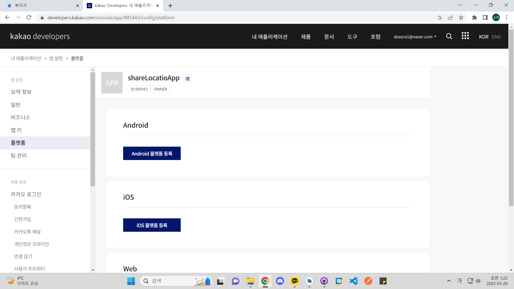
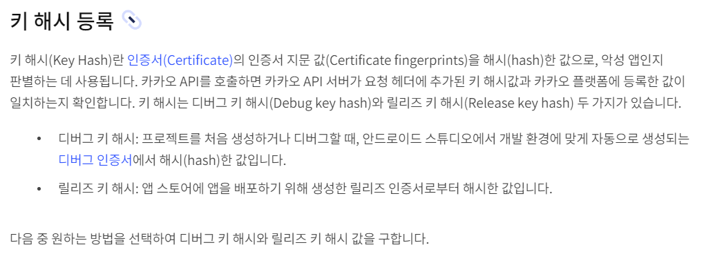
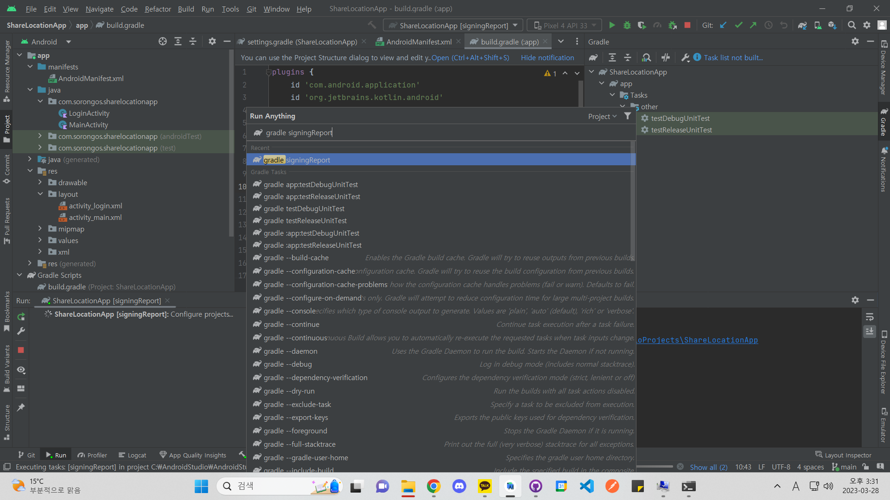
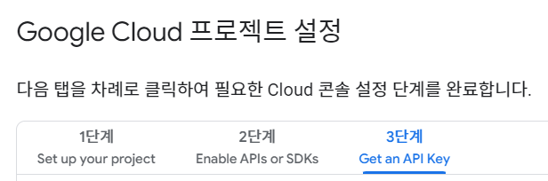
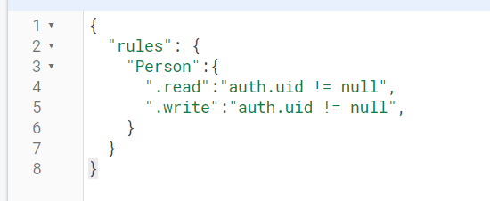

# ShareLocationApp
 위치 공유 앱
## Keyword
- 카카오 developer 앱 등록 방법
  1. 플랫폼 등록
  
  2. 키 해시 발급
  - 키 해시란?
  
  - token
  E/loginActivity: login in with kakao acount token == OAuthToken(accessToken=e_ih0umh-GFqeW2hSMGAVGyb7AVELrOUoUIhBBv9CisNHwAAAYcmqty9, accessTokenExpiresAt=Tue Mar 28 10:22:22 PDT 2023, refreshToken=ZxKKHvGGZ4SA1O56sjpMVzm2RZvl96_igKgl-g2TCisNHwAAAYcmqty8, refreshTokenExpiresAt=Fri May 26 22:22:22 PDT 2023, idToken=null, scopes=[account_email, profile_image, profile_nickname])
- 디지털 인증서 지문
  
- google cloud 프로젝트 설정
  
- Realtime Firebase 규칙
  